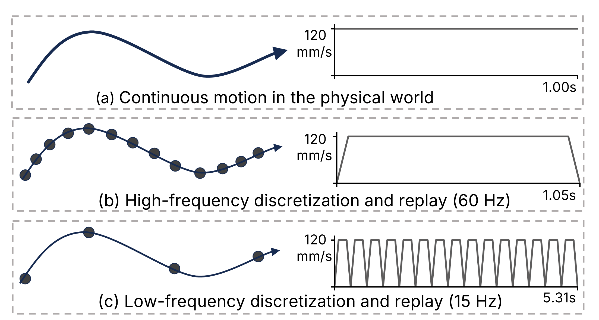
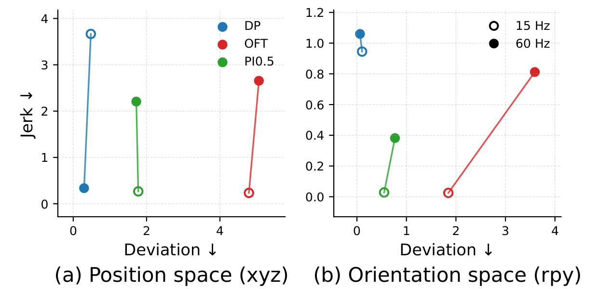
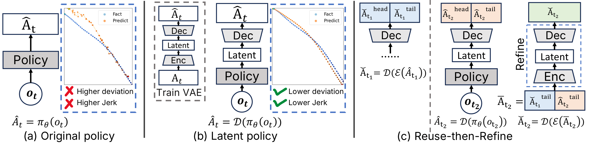
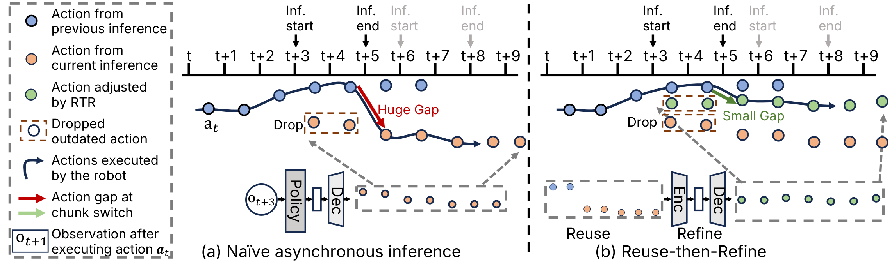
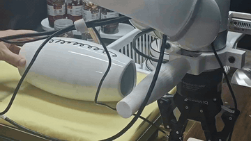
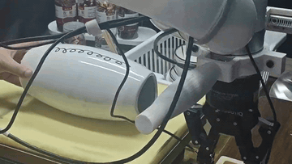

# Learning High-Frequency Continuous Action Chunks in Latent Space

This repository is the official open-source implementation of our paper
**"Learning High-Frequency Continuous Action Chunks in Latent Space"**.
It provides a Hydra-configurable, multi-process asynchronous robotics control
system for running diffusion-policy / VLA-style models on real hardware in
both synchronous and asynchronous execution modes, together with training and
inference adapters that implement the latent-space policy and the
Reuse-then-Refine (RTR) chunk-refinement strategy proposed in the paper.

## About

Modern imitation-learning policies learn and execute **action chunks** at a fixed
frequency. Low-frequency chunks (e.g. 15 Hz) cause **stop-and-go motion**
with repeated acceleration and deceleration, while high-frequency chunks
(e.g. 60 Hz) enable smooth continuous execution but are substantially
**harder to learn** directly in the action space.

<div align="center">
  
  <br/>
  <em>Action frequency shapes execution dynamics: low-frequency actions induce stop-and-go motion with obvious velocity drops, whereas high-frequency actions enable continuous motion with stable velocities.</em>
  <br/><br/>
  
  <br/>
  <em>Learning directly at 60 Hz substantially increases jerk and deviation for OFT and PI0.5; naive interpolation of low-frequency predictions to 60 Hz also fails.</em>
</div>

Our work is a co-design of **representation** and **execution** that
enables high-frequency, smooth, and continuous robot control on real
hardware.

<div align="center">
  
  <br/>
  <em>(a) Original: a policy trained directly in the high-frequency action space (large deviation, high jerk). (b) Latent: a policy trained in a continuous latent space, where a VAE decoder reconstructs a high-frequency action chunk that is both precise and smooth. (c) Reuse-then-Refine (RTR): reuses recently executed actions and refines them via the VAE to ensure continuity between consecutive chunks under asynchronous inference.</em>
  <br/><br/>
  
  <br/>
  <em>Under asynchronous inference, naively switching chunks (a) yields large discontinuities at boundaries. RTR (b) reuses recently executed actions, concatenates them with the still-valid portion of the new chunk, and refines the result through the VAE — producing a seamless transition.</em>
</div>

Our core contributions:

- Identifying that learning **high-frequency action chunks** (e.g. 60 Hz)
  directly in the action space is the key bottleneck preventing smooth,
  continuous, contact-rich robot execution.
- Proposing a **latent-space high-frequency policy**: a VAE compresses
  high-frequency action chunks into a temporally downsampled, continuous
  latent space; the policy predicts latents and the VAE decoder
  reconstructs precise, smooth high-frequency action chunks.
- Proposing **Reuse-then-Refine (RTR)**, a training-free chunk refinement
  strategy that reuses recently executed actions and refines them through
  the VAE, ensuring continuity between consecutive chunks under
  asynchronous inference.
- Providing an end-to-end async system design with training and inference
  adapters for DP, OpenVLA-OFT, and PI0.5, validated on real-world
  contact-rich tasks (peel cucumber, wipe vase, write board).

## Demos

Two real-robot video groups illustrate the two ideas above. Animated
previews are embedded as GIFs; the full-resolution MP4s live next to them
under [`artifacts/demo_videos/`](artifacts/demo_videos/). Full demo videos are available at `artifacts/demo_videos/demo_videos.zip`.

### Group 1 — High-frequency + latent enable smooth, low-jitter control

Synchronous execution on **wipe vase** with Diffusion Policy (DP). From
left to right: low-frequency (15 Hz) is slow and stop-and-go;
naively interpolating to 60 Hz introduces jitter; directly learning
60 Hz in the action space remains jittery; learning in the **latent
space** (ours) recovers smooth and stable motion.

<table align="center">
  <tr align="center">
    <td><b>DP 15 Hz</b><br/><sub>low frequency, stop-and-go</sub></td>
    <td><b>DP interpolated 60 Hz</b><br/><sub>upsampled, jittery</sub></td>
    <td><b>DP original 60 Hz</b><br/><sub>direct high-freq, jittery</sub></td>
    <td><b>DP latent 60 Hz (ours)</b><br/><sub>smooth and stable</sub></td>
  </tr>
  <tr align="center">
    <td></td>
    <td></td>
    <td></td>
    <td></td>
  </tr>
  <tr align="center">
    <td><a href="artifacts/demo_videos/sync_wipe_vase/dp_15hz.mp4">mp4</a></td>
    <td><a href="artifacts/demo_videos/sync_wipe_vase/dp_interpolated_60hz.mp4">mp4</a></td>
    <td><a href="artifacts/demo_videos/sync_wipe_vase/dp_original_60hz.mp4">mp4</a></td>
    <td><a href="artifacts/demo_videos/sync_wipe_vase/dp_latent_60hz.mp4">mp4</a></td>
  </tr>
</table>

### Group 2 — RTR removes chunk-boundary gaps under asynchronous inference

Asynchronous execution on **write board** with OpenVLA-OFT. The original
action-space policy stalls and produces visible chunk-boundary
discontinuities; the latent policy is smoother but still suffers
chunk-boundary misalignment under async inference; **RTR** (ours)
refines the seam between chunks via the VAE and yields seamless
real-time execution.

<table align="center">
  <tr align="center">
    <td><b>OFT original (async)</b><br/><sub>large chunk-boundary gaps, stalls</sub></td>
    <td><b>OFT latent (async)</b><br/><sub>smoother but boundary jumps</sub></td>
    <td><b>OFT latent + RTR (async, ours)</b><br/><sub>continuous, gap-free</sub></td>
  </tr>
  <tr align="center">
    <td></td>
    <td></td>
    <td></td>
  </tr>
  <tr align="center">
    <td><a href="artifacts/demo_videos/async_write_board/oft_original.mp4">mp4</a></td>
    <td><a href="artifacts/demo_videos/async_write_board/oft_latent.mp4">mp4</a></td>
    <td><a href="artifacts/demo_videos/async_write_board/oft_rtr.mp4">mp4</a></td>
  </tr>
</table>

## What this repository ships

- `src/rtr_async_sys/` — the async runtime (user / controller / executor /
  scheduler / env / model_wrapper components, Hydra configs).
- `third_party/` — overlays that mount our wrappers and launch scripts into
  upstream policy codebases (`lerobot`, `openvla_oft`, `openvla_oft_latent`,
  `reactive_diffusion_policy`, `hello_model`, `rlds_dataset_builder`,
  `LIBERO`).
- `scripts/` — end-to-end training / evaluation launchers.
- `docs/` — the canonical install + train + eval guides (third-party
  readmes defer here when they conflict).
- `artifacts/figures/` — figures used in this README, exported from the
  paper sources under `data/paper/`.
- `artifacts/demo_videos/` — real-robot demo videos referenced in the
  Demos section (animated GIF previews plus full-resolution MP4s).

We provide training and inference adapters for latent representations in DP,
OpenVLA-OFT, and PI0.5. We also implement the Reuse-then-Refine (RTR) method
in the policy model wrappers to improve continuity between action chunks
under asynchronous inference, thereby improving execution smoothness.

## Getting started

1. **Install** — pick your policy stack and follow the corresponding env recipe
   in `docs/environment/`:
   - `docs/environment/lerobot.md` (pi0.5 and latent variants)
   - `docs/environment/openvla_oft.md` (openvla-oft and the latent variant)
   - `docs/environment/rdp.md` (reactive diffusion policy / DP / LDP / VAE)
   - `docs/environment/rlds_env.md` (RLDS dataset processing)

2. **Train** — see `docs/best_practice/train/`:
   - `download_data.md` — dataset acquisition
   - `lerobot.md`, `openvla_oft.md`, `rdp.md` — per-policy training pipelines

3. **Evaluate** — see `docs/best_practice/inference/`:
   - `openloop/` — open-loop replay of trained policies
   - `closedloop/` — closed-loop runs on the real robot

## Repository layout

```
src/rtr_async_sys/    Async runtime (Hydra entrypoint: src/rtr_async_sys/main.py)
third_party/          Upstream policy codebases + our overlays
scripts/              Training / evaluation launchers
docs/                 Install, training, evaluation guides
```

## License

Released under the MIT License — see [`LICENSE`](LICENSE). Third-party
subdirectories under `third_party/` are governed by their own upstream
licenses (each ships its own `LICENSE` file).

## Citation

If you find RTR useful in your work, please consider citing our work.

```
@article{wang2026learning,
  title={{Learning High-Frequency Continuous Action Chunks in Latent Space}},
  author={Wang, Kunyun and Zheng, Yuhang and Zheng, Yupeng and Zhao, Jieru and Ding, Wenchao},
  journal={arXiv preprint arXiv:2605.24931},
  year={2026}
}
```
